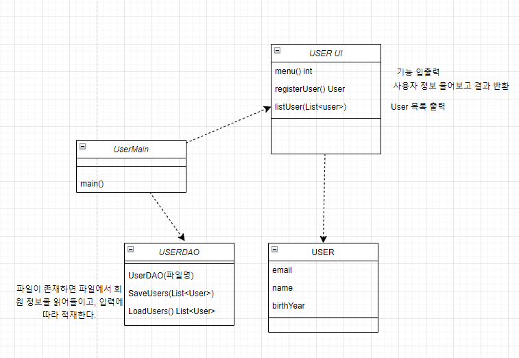

회원 관리 프로그램 만들기
----------------
기본 UI

1. 회원 등록
2. 회원 목록 보기
3. 종료

초기 프로그램 실행시 1, 2, 3을 입력하여 각 기능에 들어간다.

- 프로그램을 실행하면 /tmp/user.dat 파일에서 회원정보를 읽어온다.
- 해당 파일이 없을 경우 읽어오지 않는다.
- 프로그램 종료시, 메모리에 있는 회원 정보를 /tmp/user.dat에 저장한다.
- 프로그램을 강제 종료하면 입력된 회원 정보는 저장이 안될 수도 있다.

### 회원등록 폼

1. `"회원의 email을 입력하세요."` 출력
2. 회원의 email을 입력 받는다.
3. `"회원의 이름을 입력하세요."` 출력
4. 회원의 이름을 입력 받는다.
5. `"회원의 생년을 입력하세요."` 출력
6. 회원의 생년을 입력받는다.
7. `"등록되었습니다."` 출력

### 회원 목록 보기 구현

email 이름 생년 순으로 리스트 출력

### 클래스 다이어그램

----------------
README.md_VER_1.2